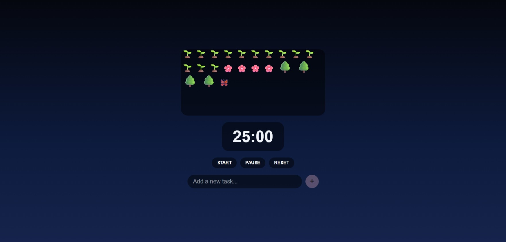

# 🌱 Focus Garden

Focus Garden is a productivity web application that combines the **Pomodoro Technique** with a **virtual growing garden**. As you complete focused work sessions and finish tasks, your garden comes to life with new plants, flowers, trees, and wildlife, turning productivity into a rewarding visual experience.

## ✨ Features

* ⏱️ **Pomodoro Timer**

  * 25-minute focus sessions
  * Start, pause, and reset controls

* ✅ **Task Manager**

  * Add, edit, complete, and delete tasks
  * Track completed tasks during each session

* 🌿 **Growing Virtual Garden**

  * Complete focus sessions to grow grass and trees
  * Complete tasks to unlock flowers
  * Earn butterflies and birds as your productivity increases

* 🌙 **Day & Night Theme**

  * The environment alternates between day and night as you complete focus sessions.

* 💾 **Local Storage**

  * Saves your tasks and garden progress so you can continue where you left off after refreshing the page.

## 🛠️ Built With

* HTML5
* CSS3
* JavaScript (Vanilla)

## 🚀 Getting Started

1. Clone or download this repository.
2. Open `index.html` in your preferred web browser.
3. Add tasks and start a Pomodoro session.
4. Watch your garden grow as you stay productive!

## 🌱 Garden Progression

Your garden evolves based on your achievements:

| Achievement                             | Reward       |
| --------------------------------------- | ------------ |
| Every completed focus session           | 🌱 Grass     |
| Every 2 completed tasks                 | 🌸 Flower    |
| Every 3 completed sessions              | 🌳 Tree      |
| Every 5 completed tasks and 2 sessions  | 🦋 Butterfly |
| Every 10 completed tasks and 5 sessions | 🐦 Bird      |

 ## 📸 Screenshot
 

## 👤 Author
-[Grace](https://github.com/Temi-ay)
